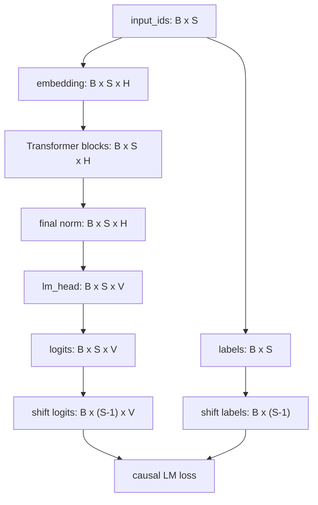

# 模型结构笔记：MiniMind Forward 主流程

## 1. 文档定位

这份文档用来解释 MiniMind 模型结构中的核心术语和主流程，重点回答：

```text
这些结构和术语到底是什么意思？
它们在 input_ids -> logits -> loss 这条链路中分别处于什么位置？
```

源码位置、类定义和逐行阅读记录放在 `source-reading.md`，这里不重复展开源码细节。

## 2. 一句话总览

MiniMind 是一个 Decoder-only Transformer。它把 tokenizer 产生的 `input_ids` 转成 `hidden_states`，再通过 `lm_head` 得到每个位置对下一个 token 的预测分数 `logits`。训练时用错位对齐后的 `logits` 和 `labels` 计算 causal LM loss；推理时逐 token 生成，并用 KV Cache 复用历史 K/V 来加速。

完整主线：

```text
文本
  -> tokenizer
  -> input_ids
  -> embedding
  -> Transformer blocks
  -> final norm
  -> lm_head
  -> logits
  -> causal LM loss / next-token generation
```

## 3. 核心术语解释

### 3.1 MiniMind

MiniMind 是这个项目中的小型大语言模型实现。它适合用来白盒学习一个 LLM 从模型结构、数据、训练到推理服务的完整链路。

在本阶段，可以先把它理解成：

```text
一个接收 token id 序列，并预测下一个 token 的神经网络。
```

### 3.2 Decoder-only Transformer

Transformer 原始结构包含 Encoder 和 Decoder。GPT、LLaMA、Qwen 这类生成式大语言模型通常使用 Decoder-only Transformer，也就是只保留 Decoder 风格的自回归结构。

它的特点：

- 输入是一串 token。
- 每个位置只能看见自己和之前的 token。
- 训练目标是预测下一个 token。
- 适合文本生成任务。

### 3.3 tokenizer

tokenizer 负责把文本切分并映射成 token id。模型不能直接处理自然语言文字，只能处理整数 id。

例如：

```text
文本: 你好，世界
input_ids: [128, 345, 27, 981]
```

tokenizer 属于模型输入前的准备环节。第 01 阶段只需要知道它产出 `input_ids`；第 02 阶段会专门研究 tokenizer 和数据。

### 3.4 input_ids

`input_ids` 是模型真正接收的输入，是一批 token id 序列。

shape 通常是：

```text
[B, S]
```

含义：

- `B`：batch size，一次处理多少条样本。
- `S`：sequence length，每条样本有多少个 token。

### 3.5 embedding

embedding 是把 token id 转成向量的查表过程。

token id 本身只是离散编号，没有连续语义。embedding 会把每个 token id 映射成一个 `hidden_size` 维向量。

shape 变化：

```text
input_ids: [B, S]
-> embedding
hidden_states: [B, S, H]
```

其中 `H` 是 hidden size。

### 3.6 hidden_states

`hidden_states` 是模型内部对每个 token 的向量表示。

刚经过 embedding 时，它只是 token 的初始向量；经过多层 Transformer Block 后，它会融合上下文信息，变成带有语境的 token 表示。

例如“苹果”：

- 在“我吃了一个苹果”中更像水果。
- 在“苹果发布了新电脑”中更像公司。

这种上下文差异会体现在不同层的 `hidden_states` 中。

### 3.7 Transformer blocks

Transformer blocks 是模型的核心层。MiniMind 会堆叠多个 `MiniMindBlock`。

每个 block 的高层结构：

```text
hidden_states
  -> RMSNorm
  -> Self-Attention
  -> residual add
  -> RMSNorm
  -> FFN / MoE
  -> residual add
```

一个 block 主要做两件事：

- Self-Attention：让 token 从上下文中获取信息。
- FFN / MoE：对 token 表示做进一步非线性加工。

### 3.8 Self-Attention

Self-Attention 用来让当前位置 token 根据上下文中其他 token 的信息更新自己的表示。

在 Decoder-only 模型中，Self-Attention 是 causal attention：

```text
当前位置只能看自己和之前的 token，不能看未来 token。
```

这保证模型训练时不能偷看答案。

### 3.9 FFN

FFN 是 Feed Forward Network，前馈网络。

Attention 更像是在做上下文信息混合；FFN 更像是在对每个 token 的表示进行进一步加工。

MiniMind 的 Dense FFN 后续会重点关注：

- `gate_proj`
- `up_proj`
- `down_proj`
- SwiGLU 风格计算

### 3.10 MoE

MoE 是 Mixture of Experts，专家混合模型。

普通 FFN 是所有 token 都走同一套 FFN；MoE 是每个 token 由 router 选择部分 expert 来处理。

它的目标是扩大模型参数容量，同时控制每个 token 的实际计算量。

### 3.11 RMSNorm

RMSNorm 是一种归一化层，用于稳定 hidden states 的数值尺度，让训练更稳定。

MiniMindBlock 中 RMSNorm 出现在 Attention 和 FFN/MoE 之前，因此它属于 Pre-Norm 结构。

### 3.12 residual connection

residual connection 是残差连接，形式是：

```text
output = sublayer(x) + x
```

作用：

- 保留子层输入中的原始信息。
- 让深层网络更容易训练。
- 缓解梯度消失。

### 3.13 final norm

`final norm` 是所有 Transformer blocks 之后的最后一次 RMSNorm。

它的作用是在输出给 `lm_head` 之前，把最后一层 `hidden_states` 再做一次归一化。

### 3.14 lm_head

`lm_head` 是 language modeling head，语言模型输出头。

它把模型内部向量投影到词表维度：

```text
hidden_states: [B, S, H]
-> lm_head
logits: [B, S, V]
```

其中：

- `H`：hidden size。
- `V`：vocab size，词表大小。

### 3.15 logits

`logits` 是模型对词表中每个 token 的原始预测分数，还不是概率。

如果词表大小是 6400，那么每个位置都会输出 6400 个分数：

```text
logits[position] = [score_0, score_1, ..., score_6399]
```

这些分数经过 softmax 后才会变成概率。训练时 cross entropy 会内部处理 softmax，所以通常直接把 logits 传给 loss。

### 3.16 labels

`labels` 是训练目标 token。

在最简单的 pretrain 场景中，通常：

```text
labels = input_ids
```

但在 SFT 中，不是所有位置都参与训练。system/user 等不希望计算 loss 的位置会被设成：

```text
-100
```

配合 `ignore_index=-100`，这些位置不会参与 cross entropy loss。

### 3.17 causal LM

causal LM 是 causal language modeling，自回归语言建模。

训练目标是：

```text
根据前面的 token 预测下一个 token。
```

例如：

```text
input_ids: [t0, t1, t2, t3]

logits[0] -> t1
logits[1] -> t2
logits[2] -> t3
```

### 3.18 causal LM loss

causal LM loss 是 next-token prediction 的交叉熵损失。

核心对齐关系：

```text
logits[..., :-1, :] 对齐 labels[..., 1:]
```

含义是：当前位置的 logits 用来预测下一个 token。

### 3.19 推理

推理是模型训练好之后，用它生成文本。

训练时：

```text
输入 input_ids 和 labels
输出 loss
```

推理时：

```text
输入 prompt
模型一步步生成新的 token
```

生成过程：

```text
prompt
  -> 输出下一个 token 的 logits
  -> 采样或选择下一个 token
  -> 把新 token 接到输入后面
  -> 继续预测
```

### 3.20 KV Cache

KV Cache 是推理加速用的缓存。

在 Attention 中，每个 token 会产生 Key 和 Value。如果每生成一个新 token 都重新计算全部历史 token 的 K/V，会非常浪费。

KV Cache 的思路：

```text
已经算过的历史 token 的 K/V 存起来；
下一步只计算新 token 的 K/V；
再和历史 K/V 拼起来做 attention。
```

简单理解：

```text
没有 KV Cache：每生成 1 个 token，都重新处理全部历史。
有 KV Cache：历史处理过就存起来，只处理新增 token。
```

### 3.21 past_key_values

`past_key_values` 是 KV Cache 在代码里的变量名。

它保存每一层过去 token 的 K/V。MiniMindModel 返回的 `presents` 就是新的 KV Cache。

### 3.22 use_cache

`use_cache` 控制是否使用 KV Cache。

通常：

```text
训练时 use_cache=False
推理时 use_cache=True
```

训练一次性处理完整序列，不需要缓存；推理逐 token 生成，使用缓存可以减少重复计算。

### 3.23 attention_mask

`attention_mask` 用来控制哪些 token 可以被 attention 看到。

常见用途：

- 屏蔽 padding token。
- 防止当前位置看到未来 token。

在 Decoder-only LM 中，不能看到未来 token 是 causal language modeling 的核心要求。

## 4. Forward 数据流



## 5. 张量 shape 主线

| 步骤 | 张量 | shape | 说明 |
|---|---|---|---|
| 输入 | `input_ids` | `[B, S]` | token id 序列 |
| Embedding | `embedding(input_ids)` | `[B, S, H]` | 每个 token 映射为 hidden vector |
| Blocks | `Transformer blocks` | `[B, S, H]` | 多层 Decoder Block，shape 不变 |
| Final Norm | `final norm` | `[B, S, H]` | 输出最终 hidden states |
| LM Head | `lm_head` | `[B, S, V]` | 投影到词表维度 |
| Shift Logits | `logits[..., :-1, :]` | `[B, S-1, V]` | 每个位置预测下一个 token |
| Shift Labels | `labels[..., 1:]` | `[B, S-1]` | next-token target |
| Loss | `cross entropy` | scalar | 展平后计算 token-level loss |

## 6. 模块分工

| 模块 | 负责什么 | 不负责什么 |
|---|---|---|
| `MiniMindConfig` | 定义模型结构超参数，例如 hidden size、层数、词表大小、attention heads、MoE 开关等。 | 不参与 forward 计算。 |
| `MiniMindModel` | 作为 backbone，负责 `input_ids -> hidden_states`。 | 不输出词表 logits，不计算 causal LM loss。 |
| `MiniMindBlock` | 作为单层 Decoder Block，负责 Attention、FFN/MoE、RMSNorm、残差连接。 | 不直接处理词表预测。 |
| `MiniMindForCausalLM` | 作为语言模型任务封装，负责 `hidden_states -> logits -> loss`。 | 不改变 backbone 的核心结构。 |

## 7. 容易混淆的点

### input_ids 不是词向量

`input_ids` 只是整数 id，必须经过 embedding 才会变成模型能处理的连续向量。

### hidden_states 不是 logits

`hidden_states` 是模型内部表示，shape 是 `[B, S, H]`；`logits` 是词表预测分数，shape 是 `[B, S, V]`。

### lm_head 不是完整模型

`lm_head` 只是最后的线性投影层，负责把 hidden states 转成词表分数。真正负责上下文建模的是前面的 Transformer blocks。

### causal LM loss 不是预测当前位置

当前位置的 logits 预测的是下一个 token，所以要使用：

```text
logits[..., :-1, :] 对齐 labels[..., 1:]
```

### 推理和训练的输入输出不同

训练关心 loss；推理关心逐步生成 token。

```text
训练：input_ids + labels -> loss
推理：prompt -> next token -> next token -> ...
```

## 8. 本任务结论

MiniMind 的 forward 主线可以概括为：

```text
MiniMindModel 负责 input_ids -> hidden_states；
MiniMindForCausalLM 负责 hidden_states -> logits -> loss。
```

更完整地说：

```text
input_ids
  -> embedding
  -> Transformer blocks
  -> final norm
  -> lm_head
  -> logits
  -> shift logits / shift labels
  -> causal LM loss
```

掌握本文件后，应该能解释每个术语的含义，并能说清楚它们在 MiniMind forward 主线中的位置。
