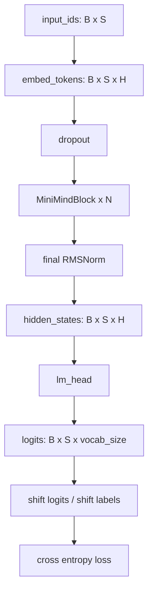

# 01 模型结构

## 目标

掌握 MiniMind 的 Decoder-only Transformer 实现，能从源码层面讲清楚 `input_ids` 如何经过 embedding、Transformer blocks、final norm、`lm_head` 变成 `logits`，以及训练时如何计算 causal LM loss、推理时如何使用 KV Cache。


## 核心文件

- `model/model_minimind.py`


## 阶段主线

```text
input_ids
  -> token embedding
  -> MiniMindBlock x N
  -> final RMSNorm
  -> lm_head
  -> logits
  -> causal LM loss / generate
```


## 必读对象

- `MiniMindConfig`
- `RMSNorm`
- `precompute_freqs_cis`
- `apply_rotary_pos_emb`
- `repeat_kv`
- `Attention`
- `FeedForward`
- `MOEFeedForward`
- `MiniMindBlock`
- `MiniMindModel`
- `MiniMindForCausalLM`
- `generate`


## 任务总览


| 任务   | 学习重点                      | 输出文档                                              |
| ---- | ------------------------- | ------------------------------------------------- |
| 任务 1 | 建立模型 forward 主线           | `source-reading.md`, `model-architecture-note.md` |
| 任务 2 | 追踪 Attention Q/K/V shape  | `attention-shape-trace.md`                        |
| 任务 3 | 理解 GQA、RoPE、YaRN、KV Cache | `source-reading.md`, `model-architecture-note.md` |
| 任务 4 | 对比 Dense FFN 和 MoE FFN    | `model-architecture-note.md`                      |
| 任务 5 | 做最小 forward 验证            | `reproduce-3060ti.md` 或 `source-reading.md`       |


## 任务清单


### 任务 1：建立模型 forward 主线

- [ ] 阅读 `MiniMindConfig`、`MiniMindForCausalLM`、`MiniMindModel`、`MiniMindBlock`。
- [ ] 画出 `input_ids -> embedding -> blocks -> norm -> lm_head -> logits` 数据流。
- [ ] 说明 `MiniMindModel` 和 `MiniMindForCausalLM` 的分工。
- [ ] 说明 labels 和 logits 如何对齐计算 next-token prediction loss。

输出：

- `source-reading.md` 中的核心类和调用关系。
- `model-architecture-note.md` 中的 forward 主流程图。

建议记录：




### 任务 2：追踪 Attention Q/K/V shape

- [ ] 阅读 `Attention.__init__`、`Attention.forward`、`repeat_kv`。
- [ ] 注释 Q/K/V 从 `[B,S,H]` 到多头形式的 shape 变化。
- [ ] 标出 RoPE、KV Cache、`repeat_kv`、transpose 的先后顺序。
- [ ] 用具体配置解释 `hidden_size`、`num_attention_heads`、`num_key_value_heads`、`head_dim` 的关系。

输出：

- `attention-shape-trace.md`

建议记录：


| 步骤         | Q shape           | K shape              | V shape              | 说明                         |
| ---------- | ----------------- | -------------------- | -------------------- | -------------------------- |
| 输入         | `[B,S,H]`         | `[B,S,H]`            | `[B,S,H]`            | block 输入                   |
| projection | `[B,S,n_heads*d]` | `[B,S,n_kv_heads*d]` | `[B,S,n_kv_heads*d]` | 线性投影                       |
| view       | `[B,S,n_heads,d]` | `[B,S,n_kv_heads,d]` | `[B,S,n_kv_heads,d]` | 拆成多头                       |
| RoPE       | `[B,S,n_heads,d]` | `[B,S,n_kv_heads,d]` | 不变                   | RoPE 只作用 Q/K               |
| KV Cache   | 不变                | 拼接历史 K               | 拼接历史 V               | 推理时复用历史 token              |
| repeat_kv  | 不需要               | `[B,S,n_heads,d]`    | `[B,S,n_heads,d]`    | GQA 对齐头数                   |
| transpose  | `[B,n_heads,S,d]` | `[B,n_heads,S,d]`    | `[B,n_heads,S,d]`    | attention 计算格式             |
| output     | -                 | -                    | `[B,S,H]`            | attention 输出回到 hidden size |


### 任务 3：解释 GQA、RoPE、YaRN、KV Cache

- [ ] 解释 GQA 中 `num_attention_heads`、`num_key_value_heads`、`n_rep` 的关系。
- [ ] 解释 `repeat_kv` 为什么是复用 K/V，而不是重新计算 K/V。
- [ ] 解释 RoPE 的预计算、注册 buffer、forward 切片和应用位置。
- [ ] 解释 YaRN 外推影响的是哪一部分频率逻辑。
- [ ] 解释 KV Cache 在推理路径中如何保存和复用 K/V。

输出：

- `source-reading.md` 中的 RoPE/YaRN/KV Cache 代码路径。
- `model-architecture-note.md` 中的 GQA、RoPE、KV Cache 机制说明。

建议记录：

```text
MiniMindConfig 设置 rope_theta / rope_scaling
  -> MiniMindModel.__init__ 预计算 freqs_cos / freqs_sin
  -> register_buffer 保存为非参数状态
  -> MiniMindModel.forward 按 start_pos 切片
  -> Attention.forward 将 cos/sin 应用到 Q/K
  -> 推理时把当前 K/V 与 past_key_values 拼接
```


### 任务 4：对比 Dense FFN 和 MoE FFN

- [ ] 阅读 `FeedForward`。
- [ ] 阅读 `MOEFeedForward`。
- [ ] 说明 Dense FFN 中 `gate_proj`、`up_proj`、`down_proj` 的作用。
- [ ] 说明 MoE 中 router、top-k expert、token dispatch、aux loss 的作用。
- [ ] 说明 `config.use_moe` 如何改变 `MiniMindBlock` 的 FFN 路径。

输出：

- `model-architecture-note.md` 中的 Dense FFN vs MoE FFN 对比表。

建议记录：


| 对比项         | Dense FFN                | MoE FFN                       |
| ----------- | ------------------------ | ----------------------------- |
| 入口类         | `FeedForward`            | `MOEFeedForward`              |
| token 路径    | 所有 token 走同一套 FFN        | 每个 token 由 router 选择部分 expert |
| 核心计算        | SwiGLU + down projection | router + top-k experts + 聚合   |
| 参数量         | 固定                       | expert 越多参数越多                 |
| 单 token 计算量 | 固定                       | 取决于 `num_experts_per_tok`     |
| 额外损失        | 无                        | `aux_loss`                    |
| 配置开关        | `use_moe=False`          | `use_moe=True`                |


### 任务 5：最小 forward 验证

- [ ] 构造一个最小 `MiniMindConfig`。
- [ ] 随机生成一批 `input_ids`。
- [ ] 执行 `MiniMindForCausalLM(input_ids=input_ids, labels=input_ids)`。
- [ ] 检查 `logits` shape 是否符合预期。
- [ ] 检查 `loss` 是否是有限浮点数。

输出：

- `reproduce-3060ti.md` 或 `source-reading.md` 中的验证记录。

建议命令：

```bash
python - <<'PY'
import torch
from model.model_minimind import MiniMindConfig, MiniMindForCausalLM

config = MiniMindConfig(
    hidden_size=128,
    num_hidden_layers=2,
    num_attention_heads=4,
    num_key_value_heads=2,
    vocab_size=1000,
    max_position_embeddings=128,
)

model = MiniMindForCausalLM(config)
input_ids = torch.randint(0, config.vocab_size, (2, 16))
out = model(input_ids=input_ids, labels=input_ids)

print("logits:", tuple(out.logits.shape))
print("loss:", float(out.loss))
PY
```

预期结果：

- `logits` 为 `(2, 16, 1000)`。
- `loss` 是有限浮点数。

建议结构：

```md
# 阶段总结：MiniMind 模型结构

## 1. 阶段目标

## 2. 任务完成情况

| 任务 | 状态 | 对应文档 | 说明 |
|---|---|---|---|
| 建立模型 forward 主线 |  |  |  |
| 追踪 Attention Q/K/V shape |  |  |  |
| 解释 GQA/RoPE/YaRN/KV Cache |  |  |  |
| 对比 Dense FFN 和 MoE FFN |  |  |  |
| 最小 forward 验证 |  |  |  |

## 3. 模型主流程

## 4. Attention shape 追踪

## 5. GQA、RoPE、YaRN、KV Cache

## 6. Dense FFN vs MoE FFN

## 7. 最小实验验证

## 8. 当前仍未理解的问题

## 9. 下一阶段准备
```


## 阶段输出文件

完成后，本阶段目录建议包含：

```text
minimind-lab/01_model_arch/
├── tasks.md
├── source-reading.md
├── model-architecture-note.md
├── attention-shape-trace.md
├── reproduce-3060ti.md
└── stage-summary.md
```


## 阶段完成标准

完成本阶段后，需要能独立回答：

1. `MiniMindModel` 和 `MiniMindForCausalLM` 分别负责什么？
2. 一个 `MiniMindBlock` 内部的 RMSNorm、Attention、FFN、残差连接顺序是什么？
3. Attention 中 Q/K/V 的 shape 如何变化？
4. GQA 为什么允许 `num_attention_heads` 和 `num_key_value_heads` 不同？
5. RoPE 和 YaRN 在源码中的位置分别是什么？
6. KV Cache 在推理路径中如何保存和复用 K/V？
7. Dense FFN 和 MoE FFN 的计算路径有什么区别？
8. `labels` 和 `logits` 如何对齐计算 causal LM loss？


## 验收 Checklist

- [ ] 已阅读 `model/model_minimind.py` 的核心类。
- [ ] 已完成 `source-reading.md`。
- [ ] 已画出 forward 数据流。
- [ ] 已能区分 `MiniMindModel` 和 `MiniMindForCausalLM`。
- [ ] 已完成 `attention-shape-trace.md`。
- [ ] 已写出 Q/K/V shape 表。
- [ ] 已能解释 GQA 和 `repeat_kv`。
- [ ] 已能解释 RoPE、YaRN 和 KV Cache 的代码位置。
- [ ] 已能对比 Dense FFN 与 MoE FFN。
- [ ] 已跑通一次最小 forward smoke test。
- [ ] 已完成 `stage-summary.md`。